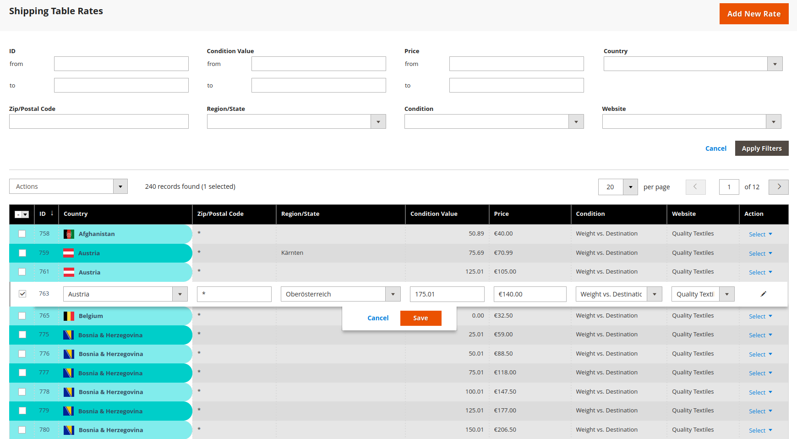

---

# DevAll_TableRates Module


The DevAll_TableRates module enhances the default Magento functionality for managing shipping table rates by providing a user-friendly interface for viewing and managing table rates.

---



---


## Installation

1. Install the module via Composer by running the following command in the Magento 2 root directory:

   ```
   composer require developersalliance/module-table-rates
   ```

2. Run the Magento upgrade command to install the module:

   ```
   bin/magento setup:upgrade
   ```

## Features

- View and manage shipping table rates through an intuitive user interface.
- Add, edit, and delete table rates using a Magento grid.
- Supports filtering, sorting, column controls, inlineEditing, Delete MassAction and pagination for easy navigation and management.
- Enhanced validation to ensure accurate data entry.


## License

This module is licensed under the [MIT License](LICENSE.txt).

---

## Compatability

- All php versions starting from 7.3 and higher are supported
- All Magento/Adobe Commerce versions starting from 2.3.x and higher
- If require it for an older version of Magento/PHP we can adjust it individually to fit your website for a special fee.

